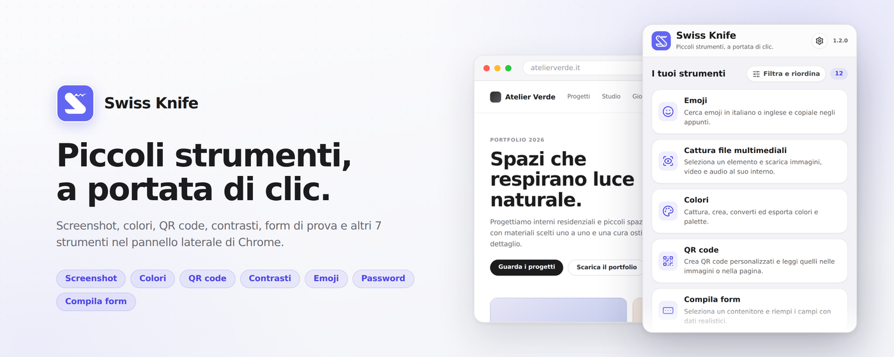

# Swiss Knife



Swiss Knife raccoglie **12 strumenti per lavorare sulle pagine web** in un unico pannello laterale: cattura immagini e screenshot, ispeziona elementi, controlla colori e contrasti, compila form di prova e genera contenuti da copiare.

L’interfaccia è in italiano, con tema chiaro e un catalogo personalizzabile. Gli strumenti di conversione e generazione lavorano localmente; quelli che analizzano la pagina operano su richiesta.

[Scarica una release](https://github.com/inerba/swiss-knife/releases) · [Segnala un problema](https://github.com/inerba/swiss-knife/issues)

## Installazione

Per usare una release non servono Node.js, pnpm o altri strumenti di sviluppo. Il progetto è sviluppato per **Chrome 123 o successivo**, con Manifest V3. Su **Microsoft Edge desktop** puoi usare la stessa build Chromium; il comportamento del pannello e dei permessi va verificato nel browser utilizzato.

### Dal file ZIP

1. Scarica lo ZIP dell’estensione dalla pagina [Releases](https://github.com/inerba/swiss-knife/releases). Scegli il pacchetto `swiss-knife-<versione>-chrome.zip`, non gli archivi **Source code** generati da GitHub.
2. Apri la pagina delle estensioni digitando nella barra degli indirizzi:
   - Chrome: `chrome://extensions`
   - Edge: `edge://extensions`
3. Attiva **Modalità sviluppatore**.
4. Trascina il file ZIP dalla cartella Download al centro della pagina delle estensioni.
5. Apri una normale pagina web e fai clic su **Swiss Knife** nel menu Estensioni. Puoi fissare l’icona nella barra degli strumenti per averla sempre a portata di mano.

Se il browser non accetta il trascinamento, estrai lo ZIP, premi **Carica estensione non pacchettizzata** e seleziona la cartella che contiene `manifest.json`. In questo caso conserva la cartella nella stessa posizione: il browser la usa per caricare l’estensione.

### Aggiornamento manuale

Le installazioni locali non ricevono automaticamente le nuove release. Se hai caricato una cartella, sostituisci il suo contenuto con i file della nuova versione e premi **Ricarica** nella scheda dell’estensione. Se hai installato tramite trascinamento, carica il nuovo ZIP dalla stessa pagina. Chiudi e riapri il pannello dopo l’aggiornamento.

## Primo utilizzo

Apri il pannello dall’icona **Swiss Knife** mentre è attiva la pagina su cui vuoi lavorare. Questo gesto concede l’accesso temporaneo alla scheda; aprire soltanto il pannello laterale non concede lo stesso permesso.

Per usare gli strumenti passando tra siti e schede puoi scegliere **Abilita su tutti i siti** e confermare la richiesta del browser. L’autorizzazione è facoltativa e revocabile dalle impostazioni. Senza questo consenso, usa l’icona dell’estensione sulla pagina desiderata prima di avviare un’operazione.

Al cambio scheda o alla navigazione, le operazioni e i risultati legati alla pagina precedente vengono invalidati. Lo strumento rimane selezionato e attende una nuova azione: non riparte una scansione automaticamente.

Nelle **Impostazioni** puoi attivare o nascondere gli strumenti e modificarne l’ordine, trascinandoli o usando i pulsanti di spostamento. Il catalogo consente anche ricerca e ordinamento alfabetico. Le preferenze vengono conservate nel profilo locale del browser.

## Strumenti disponibili

Gli strumenti sono elencati nell’ordine predefinito della prima installazione. Puoi personalizzarlo dalle impostazioni.

| Strumento | Funzionalità |
| --- | --- |
| **Emoji** | Cerca emoji in italiano o inglese, le copia e consente di trascinarle nei campi compatibili. |
| **Cattura file multimediali** | Seleziona un elemento e raccoglie immagini, video, audio e altre risorse al suo interno. |
| **Colori** | Campiona colori, estrae palette e converte o esporta i codici. |
| **QR code** | Crea QR personalizzati e legge quelli presenti in immagini o nella pagina. |
| **Compila form** | Riempie i campi selezionati con dati fittizi in italiano o inglese, senza inviare il modulo. |
| **Lorem Ipsum** | Genera da 1 a 100 paragrafi di testo segnaposto. |
| **Screenshot** | Cattura la pagina intera, la parte visibile o un rettangolo selezionato. |
| **Contrasti** | Calcola il rapporto di contrasto tra testo e sfondo e mostra gli esiti dei criteri WCAG 2.1. |
| **Ispeziona e salva** | Mostra le proprietà di un elemento ed esporta un’anteprima PNG o uno snippet HTML e CSS. |
| **Codifica e converti** | Converte testo e rappresentazioni di byte; calcola hash localmente. |
| **Generatore password** | Genera password con lunghezza, caratteri e regole personalizzabili. |
| **Elenca iframe** | Elenca i contenuti incorporati nella pagina e apre gli URL accessibili in nuove schede. |

### Emoji

Cerca per nome o parola chiave in italiano e inglese, filtra per categoria e scegli la tonalità della pelle per le emoji compatibili. Un clic copia la sequenza Unicode; puoi anche trascinarla nei normali campi testo e nelle aree modificabili della pagina.

Il catalogo Emojibase è incluso nell’estensione e non richiede connessione. Le impostazioni offrono cinque dimensioni di anteprima, da 22 a 60 px. Aspetto e disponibilità dei caratteri dipendono dal sistema operativo; editor complessi possono non accettare il trascinamento.

### Cattura file multimediali

Seleziona un elemento della pagina per raccogliere le sue risorse e quelle dei discendenti, anche fuori dal punto selezionato. Usa **Freccia su** per ampliare la selezione al contenitore padre, **Freccia giù** per tornare indietro ed **Esc** per annullare.

Lo strumento riconosce immagini, sfondi CSS, video, audio, poster, sottotitoli e collegamenti diretti a file. Mostra anteprime e, quando disponibili, formato, dimensioni, peso e durata. Puoi aprire l’originale, copiare i contenuti supportati o scaricare un singolo file. **Scarica tutti** raggruppa i download in `cattura-media/<dominio>/` nella cartella di download del browser.

Il recupero dei metadati può richiedere un’autorizzazione per l’origine del file tramite **Autorizza e completa**. Le richieste non includono credenziali e non seguono reindirizzamenti. Il recupero è limitato a 32 MiB per file; per URL HTTP/HTTPS rimane disponibile il download diretto.

Non ricostruisce video da playlist HLS/DASH, dirette MediaSource o contenuti DRM. Canvas, gradienti e SVG inline senza file referenziati non vengono esportati da questo strumento. File temporanei, contenuti protetti e formati non supportati dal browser possono limitare anteprime e download.

### Colori

Usa il contagocce per campionare un pixel, **Genera Palette** per raccogliere i colori della pagina oppure **Da elemento** per estrarli dagli stili di una selezione.

Sono disponibili HEX, RGB, HSL, OKLab, OKLCH e Display P3, oltre al colore Tailwind CSS 4 più vicino. La cronologia locale conserva fino a 50 colori e può essere copiata o esportata come codici, variabili CSS o classi Tailwind. Le palette estratte restano temporanee finché non scegli **Salva selezionati**.

L’estrazione dagli elementi legge gli stili, inclusi bordi, ombre e gradienti: non analizza i pixel di immagini, video o canvas.

### QR code

Crea QR statici per URL, testo, Wi-Fi, contatti vCard, email, telefono e SMS. Personalizza forme, colori, sfondo, margini e logo; salva lo stile come preset ed esporta in PNG o SVG. Il logo rimane nella sessione e non viene incluso nei preset.

Nella scheda **Leggi** puoi caricare un’immagine PNG, JPEG o SVG, incollarla dagli appunti o selezionare un QR nella pagina. La lettura in pagina richiede che il codice sia interamente visibile e non coperto. Il risultato può essere copiato; gli URL HTTP/HTTPS vengono aperti solo su richiesta.

### Compila form

Scegli italiano o inglese, premi **Seleziona elemento** e indica il contenitore da compilare. Lo strumento riconosce i controlli HTML nativi e inserisce dati fittizi coerenti, attivando gli eventi `input` e `change` senza inviare il modulo.

Le impostazioni permettono di preservare i campi già compilati, ignorare campi specifici e definire una password di prova. Se non la imposti, viene generata una password casuale per ogni form. L’eventuale password prefissata viene salvata nelle preferenze locali.

Consensi e termini, CAPTCHA, campi nascosti, file, controlli disabilitati o di sola lettura e widget non nativi restano esclusi. I contenuti degli iframe non accessibili non possono essere compilati.

### Lorem Ipsum

Scegli da 1 a 100 paragrafi e genera testo segnaposto. **Copia** genera un nuovo testo e lo copia negli appunti; il risultato rimane disponibile nell’area di testo anche quando la copia non è autorizzata.

### Screenshot

Scegli **Pagina intera**, **Schermata** o **Seleziona rettangolo**, quindi salva in PNG, JPEG o WebP oppure copia negli appunti. Se il browser non supporta la copia del formato scelto, usa PNG o scarica il file.

Per la pagina intera puoi mantenere la larghezza corrente oppure impostarla tra 320 e 2560 px, anche tramite i preset Mobile e Desktop. La finestra viene ridimensionata temporaneamente per catturare il layout corrispondente e ripristinata al termine. La cattura scorre il documento e limita le ripetizioni degli elementi fissi.

Pagine molto grandi possono superare i limiti del canvas del browser. In questi casi usa la schermata o un’area più piccola. La selezione rettangolare riguarda la porzione visibile e non scorre la pagina.

### Contrasti

Inserisci i colori di testo e sfondo, usa il contagocce oppure seleziona **Da elemento**. Il rapporto di contrasto e gli esiti AA/AAA per testo normale e grande, insieme al criterio 1.4.11 per elementi non testuali, si aggiornano con i colori scelti.

Il campionamento di un elemento usa gli stili calcolati. Immagini, gradienti e trasparenze possono richiedere una verifica con il contagocce. Il risultato riguarda la coppia di colori analizzata e non costituisce una verifica completa dell’accessibilità della pagina.

### Ispeziona e salva

Premi **Seleziona** e punta un elemento per vedere dimensioni, margini, padding e raggio dei bordi. Fai clic per fissarlo, regola la selezione con le frecce e premi **Conferma** per acquisirlo. **Esc** annulla l’ispezione.

La scheda **Info** mostra struttura, classi, tipografia, sfondo, bordi e layout. Puoi copiare lo snippet HTML e CSS, scaricarlo come file HTML o salvare l’anteprima PNG. Gli elementi più grandi del viewport vengono catturati a tasselli.

Lo snippet viene sanitizzato e conserva gli URL originali delle immagini: non è una copia autonoma dell’intera pagina. Overflow nascosto, elementi fissi e iframe non accessibili possono limitare la resa della cattura.

### Codifica e converti

Scegli i formati **Da** e **A** per convertire tra testo UTF-8, Base64 standard, URL encoded, Unicode escaped, HEX e binario. **Copia** copia il risultato; **Usa come input** lo prepara per una nuova conversione. Spazi, ritorni a capo e contenuti JSON non vengono riformattati.

Le conversioni lavorano sui byte; il passaggio a testo richiede UTF-8 valido. Base64url non è supportato e, nella decodifica URL, `+` rimane un carattere letterale.

La modalità **Hash** calcola MD5, SHA-256, SHA-512 o SM3 sul testo UTF-8 inserito. Input e risultati restano temporanei, senza cronologia e senza richieste di rete.

### Generatore password

Genera password da 4 a 64 caratteri usando `crypto.getRandomValues()`. Puoi scegliere numeri, maiuscole, minuscole e simboli, modificare l’insieme dei simboli ed escludere caratteri simili, sequenze o ripetizioni. È disponibile anche l’opzione per iniziare con una lettera.

Le combinazioni impossibili producono un errore invece di un risultato incompleto. Vengono salvate soltanto le opzioni: le password generate non vengono conservate né inviate a server esterni.

### Elenca iframe

Avvia la scansione per vedere gli iframe presenti nel documento, compresi quelli annidati accessibili. Ogni riga corrisponde a un elemento; il livello 0 indica un iframe nel documento principale. **Apri** porta il suo URL HTTP/HTTPS in una nuova scheda.

Gli iframe di un’altra origine possono essere elencati, ma il loro contenuto non accessibile non viene esplorato. Gli URL sono quelli dichiarati nella pagina e possono cambiare dopo un reindirizzamento. Iframe inline o senza un URL HTTP/HTTPS non hanno un collegamento apribile.

## Permessi e privacy

| Permesso | Utilizzo |
| --- | --- |
| `activeTab` | Accesso temporaneo alla scheda dopo il clic sull’icona dell’estensione. |
| `scripting` | Esecuzione dei selettori e degli strumenti sulla pagina richiesta. |
| `sidePanel` | Apertura del pannello laterale. |
| `downloads` | Salvataggio dei file tramite il gestore download del browser. |
| `storage` | Preferenze locali, preset e cronologia colori. |
| `clipboardWrite` | Copia dei risultati negli appunti su richiesta. |
| `<all_urls>` facoltativo | Accesso ai siti dopo un consenso esplicito; non viene concesso all’installazione. |

I contenuti analizzati non vengono inviati a servizi esterni di analisi. Il recupero dei file multimediali e i download contattano i server che ospitano le risorse; i file salvati e la cronologia download rimangono gestiti dal browser.

I risultati delle analisi della pagina sono temporanei. Le preferenze, i preset e i colori salvati restano nel profilo locale; fanno eccezione ai dati temporanei anche le impostazioni inserite volontariamente, come la password di prova di **Compila form**.

Le pagine interne del browser, gli store delle estensioni e i file locali non sono pagine di lavoro supportate. Gli strumenti rispettano le restrizioni di accesso: non ispezionano shadow root chiusi o contenuti di iframe cross-origin non accessibili.

## Sviluppo locale

Il progetto usa **WXT, React, TypeScript e pnpm**, con icone **Lucide**. Per l’ambiente di sviluppo usa Node.js 22.13+ della serie 22 oppure Node.js 24+, e pnpm 11.

```sh
git clone https://github.com/inerba/swiss-knife.git
cd swiss-knife
pnpm install
pnpm dev
```

Per caricare manualmente la build di sviluppo, seleziona `.output/chrome-mv3-dev` dalla pagina delle estensioni tramite **Carica estensione non pacchettizzata**.

### Comandi

| Comando | Descrizione |
| --- | --- |
| `pnpm dev` | Avvia WXT in modalità sviluppo. |
| `pnpm compile` | Verifica i tipi TypeScript senza generare output. |
| `pnpm test` | Esegue i test con Vitest. |
| `pnpm build` | Genera la build di produzione in `.output/chrome-mv3`. |
| `pnpm zip` | Chiede la versione e genera il pacchetto ZIP di produzione. |
| `pnpm zip -- 1.2.0` | Genera il pacchetto con una versione esplicita, anche in un terminale non interattivo. |

Il comando ZIP aggiorna la versione in `package.json` quando necessario; WXT la riporta nel manifest. Il file prodotto segue il formato `.output/swiss-knife-<versione>-chrome.zip`. Sostituisci `1.2.0` con la versione da pubblicare.

Gli script WXT includono `--no-experimental-webstorage` per evitare incompatibilità tra il Web Storage di Node.js e l’ambiente di build.

### Struttura del progetto

```text
entrypoints/          Pannello, impostazioni, background e script iniettati
src/App.tsx           Struttura comune del pannello
src/tools/            Moduli degli strumenti
src/tools/types.ts    Contratto ToolDefinition
src/tools/registry.ts Registro del catalogo
src/lib/              Helper, permessi e preferenze condivisi
src/style.css         Stili e token condivisi
public/               Risorse statiche incluse nella build
scripts/              Packaging, icone e verifiche browser
```

### Licenze di terze parti

Le licenze, i copyright e le attribuzioni dei componenti distribuiti sono raccolti in [THIRD-PARTY-NOTICES.txt](public/THIRD-PARTY-NOTICES.txt). Il file comprende le librerie degli strumenti, le dipendenze runtime condivise, gli avvisi Feather inclusi da Lucide e i dati Tailwind e Unicode/CLDR. WXT copia il file dalla cartella `public` nella radice della build e dello ZIP installabile.

Quando aggiungi, rimuovi o aggiorni una dipendenza o un dataset incorporato, aggiorna anche questo documento: controlla la versione effettivamente risolta nel lockfile e installata, gli import operativi e le dipendenze transitive incluse nella build. Conserva i testi completi dei file `LICENSE`, `LICENCE` e degli eventuali `NOTICE`, inclusi i copyright storici; per fonti esterne annota URL e data di consultazione. Se modifichi direttamente codice Apache-2.0, segnala le modifiche nei file interessati e conserva gli avvisi pertinenti.

Prima di distribuire, genera lo ZIP con `pnpm zip -- 1.2.0` (sostituendo la versione quando necessario) e verifica che `THIRD-PARTY-NOTICES.txt` sia presente nella radice dell'archivio e identico a quello in `public`. La presenza delle licenze soltanto nel repository o in `node_modules` non sostituisce la loro inclusione nel pacchetto distribuito.

### Contributi e verifiche

Per proporre una correzione o una funzionalità, apri una issue descrivendo il caso d’uso. Per i problemi indica browser e versione, versione dell’estensione, passaggi per riprodurre il comportamento ed eventuali messaggi di errore.

Prima di modificare il codice, leggi [AGENTS.md](AGENTS.md). Ogni strumento vive in `src/tools/<id>/` e viene registrato una sola volta in `src/tools/registry.ts`, con nome italiano e icona Lucide. Riusa gli helper condivisi e mantieni le operazioni sulla pagina legate a un’azione esplicita.

Per le modifiche funzionali esegui:

```sh
pnpm compile
pnpm test
pnpm build
```

Verifica anche nel browser le interazioni interessate, i permessi, il cambio scheda, la navigazione e l’uso da tastiera. I test con API simulate non sostituiscono una prova del pannello nativo. Per sole modifiche alla documentazione è sufficiente controllare contenuti, percorsi e comandi.
