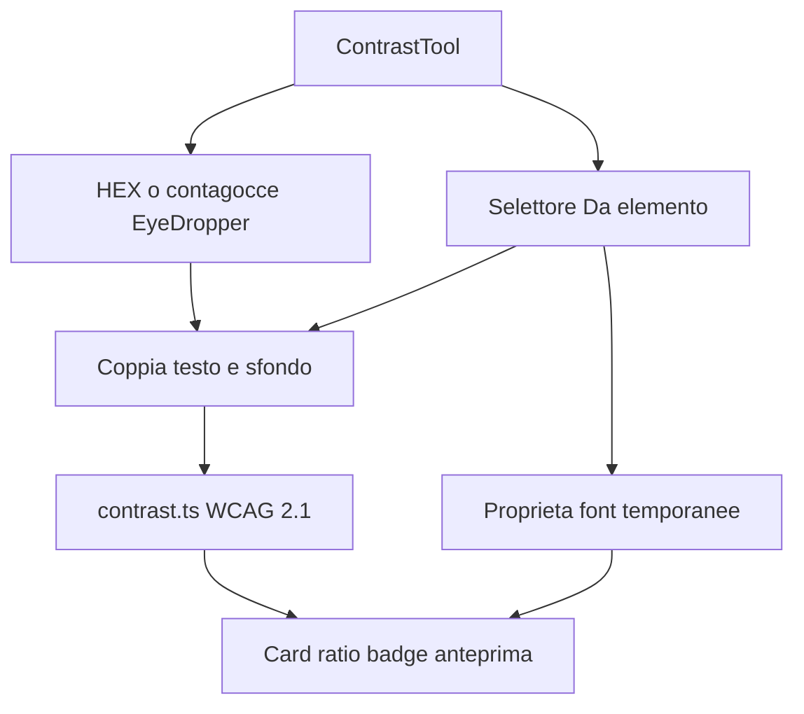

# Contrasti — design

Data: 2026-09-06  
Stato: approvato in brainstorming, in attesa di revisione sulla spec

## Problema

Swiss Knife ha già **Colori** (contagocce, palette, conversioni) ma non valuta se una coppia testo/sfondo è leggibile. Serve uno strumento dedicato, sul modello del Colour Contrast Analyser, con la grafica compatta del secondo riferimento (campi HEX, ratio grande, badge pass/fail).

## Obiettivi

- Scegliere un colore di testo e uno di sfondo con HEX, contagocce per campo, oppure **Da elemento**.
- Calcolare subito il rapporto di contrasto WCAG 2.1 e mostrare pass/fail per testo normale, testo grande e contrasto non-testo.
- Anteprima dal vivo del testo sul colore di sfondo.
- Nessun nuovo permesso, nessuna cronologia, nessun invio a servizi esterni.

## Fuori ambito (v1)

- Slider RGB/HSL e menu di formato (HEX/RGB/HSL).
- Overlay persistente o contrasto al passaggio del mouse.
- APCA / WCAG 3.
- Suggerimenti automatici di colori “vicini” che passano.
- Integrazione nella cronologia di **Colori**.
- Salvataggio della coppia o delle proprietà del font.

## Approccio

Nuovo strumento di catalogo, non una sezione di Colori.

| Scelta | Valore |
|---|---|
| `id` | `contrast` |
| Nome | Contrasti |
| Icona | `Contrast` da `lucide-react` |
| Modulo | `src/tools/contrast/` |
| Registro | una sola voce in fondo a `src/tools/registry.ts` |
| Permessi | invariati (`activeTab`, `scripting`, `clipboardWrite`, host opzionale esistente) |

## Architettura

Unità e dipendenze:

- `contrast.ts` — parsing della coppia, luminanza relativa, ratio, soglie, etichetta qualitativa. Funzioni pure, testabili senza Chrome.
- `sample.ts` — composizione dello sfondo e lettura font da un elemento. Funzioni pure sui computed style già letti, più un adattatore DOM nello script iniettato.
- `session.ts` + `entrypoints/contrast.ts` — selettore pagina su richiesta, stesso ciclo di vita di form-filler/colori: iniezione al clic, port legato al `documentId`, pulizia su Esc, navigazione o disconnessione.
- `ContrastTool.tsx` — stato, accessibilità, invalidazione scheda.
- `colors/color.ts` — riuso di `parseColor`, `displayHex` e, se serve, `opaqueHex`. Non riusare `useColorAcquisition`: salva in cronologia e mescola palette e pixel.

`App.tsx` non riceve rami specifici per questo tool.

## Interfaccia

Pannello laterale stretto (~360px), italiano, icone Lucide, temi chiaro/scuro.

Ordine verticale:

1. Titolo **Contrasti** e una riga di aiuto.
2. Due campi HEX affiancati: **Testo** e **Sfondo**. Ogni campo ha sfondo del colore scelto, testo leggibile sul campione, contagocce e copia. **Scambia** sta al centro, tra i due campi.
3. **Da elemento** a tutta larghezza.
4. Anteprima: frase di esempio con `color` = testo e `background` = sfondo.
5. Card **Contrasto**: ratio grande (`X.X : 1`, un decimale) e etichetta qualitativa.
6. Badge:
   - Testo normale: AA 4.5:1, AAA 7:1
   - Testo grande: AA 3:1, AAA 4.5:1
   - Non-testo (1.4.11): AA 3:1
7. **Proprietà testo** solo dopo un **Da elemento** riuscito: famiglia, dimensione, interlinea. Informative: i quattro badge testo restano comunque visibili.

Default all’apertura: testo `#000000`, sfondo `#FFFFFF`.

Il HEX è l’unico formato editabile. Input libero; al valore valido si ricalcola tutto. Copia scrive il HEX canonico (`displayHex`) negli appunti.

## Flusso

1. L’utente può digitare, incollare, usare il contagocce di un campo, scambiare o avviare **Da elemento**.
2. Il contagocce usa `window.EyeDropper` nel pannello, nello stesso gesto di clic, e assegna `sRGBHex` a quel campo. Non richiede accesso alla pagina.
3. **Da elemento** acquisisce la scheda al momento del clic, inietta lo script e mostra il mirino. Clic o Invio confermano; ↑/↓ cambiano contenitore; Esc annulla. Il clic non attiva link o pulsanti sotto il livello.
4. Dal nodo scelto si leggono `color`, la catena di `background-color` composta fino al primo strato opaco, `font-family`, `font-size`, `line-height`, `font-weight`. I due HEX e le proprietà font vengono sempre sostituiti (non si mescolano con la coppia precedente). Se `background-image` non è `none`, o lo sfondo resta trasparente fino a `html`, si mostra un avviso e si invita al contagocce. Non si campionano pixel di immagini, canvas o video.
5. Ratio e badge si aggiornano solo da una coppia valida. Non si avvia nulla al solo cambio scheda.

### Cambio scheda o navigazione

- Si annullano contagocce e selettore in corso.
- Si ignorano risposte asincrone superate.
- Si azzerano proprietà font, avvisi pagina e stato del selettore.
- I due HEX restano (scelta esplicita in brainstorming).
- Lo strumento selezionato nel catalogo resta quello.

## Calcolo WCAG 2.1

Algoritmo WCAG 2.1 relativo (non APCA). Si usa `colorjs.io` con il metodo di contrasto `WCAG21`. I test fissano coppie note così un cambio di libreria non passa inosservato.

Prima del ratio, i canali con alpha si appiattiscono: il testo si composita sullo sfondo già composto; uno sfondo ancora semitrasparente si composita sul bianco del canvas.

Soglie:

| Criterio | Soglia | Badge |
|---|---|---|
| 1.4.3 AA testo normale | 4.5:1 | AA 4.5:1 |
| 1.4.3 AA testo grande | 3:1 | AA 3:1 |
| 1.4.6 AAA testo normale | 7:1 | AAA 7:1 |
| 1.4.6 AAA testo grande | 4.5:1 | AAA 4.5:1 |
| 1.4.11 AA non-testo | 3:1 | AA 3:1 |

Etichetta qualitativa (italiano):

| Ratio | Etichetta |
|---|---|
| &lt; 3 | Insufficiente |
| 3 – 4.499… | Sufficiente |
| 4.5 – 6.999… | Buono |
| ≥ 7 | Ottimo |

Testo grande WCAG (18pt / 14pt grassetto) non nasconde i badge: le proprietà font, se presenti, restano un’informazione a lato.

## Errori e limiti

- HEX incompleto o non valido: `aria-invalid` sul campo, messaggio vicino, card risultati non mostra pass/fail di una coppia precedente.
- `EyeDropper` assente: il pulsante è disabilitato e un testo spiega che restano HEX e **Da elemento**.
- Contagocce o selettore annullati: stato “Annullato”, si può riprovare.
- Pagine Chrome, Web Store, file locali, mancanza di `activeTab`: `explainError` esistente, vicino all’azione **Da elemento**.
- Iframe cross-origin, shadow root chiusi: non ispezionabili; messaggio esplicito.
- Immagine, gradiente o sfondo non risolvibile: avviso, HEX non presentati come lettura pixel-perfect.
- Copia fallita: messaggio vicino al pulsante, il valore resta selezionabile.
- Non si aggirano same-origin né si ricostruiscono contenuti non accessibili.

## Test

Test mirati, non copie del markup:

- Nero/bianco = 21:1; coppie note intorno a 3 / 4.5 / 7.
- Matrice pass/fail dei cinque badge.
- Composizione alpha testo-su-sfondo e sfondo-su-antenati.
- HEX non valido: niente esito WCAG.
- Dopo cambio scheda, un risultato selettore in ritardo non aggiorna font né colori.
- `App.test.tsx` / registro: lo strumento compare nel catalogo.

Verifiche di consegna: `pnpm compile`, `pnpm test`, `pnpm build`. `pnpm zip` per la build installabile. Il contagocce nativo e il selettore pagina si verificano in Chrome se il browser è disponibile; i mock dei test non li sostituiscono.

## Documentazione

Aggiornare il README (sezione nuovo strumento, limiti, uso). `AGENTS.md` solo se cambia l’architettura condivisa (non previsto: stesso pattern di iniezione su richiesta).

Aggiungere `.superpowers/` a `.gitignore` così i mockup del companion non finiscono nel repository.
