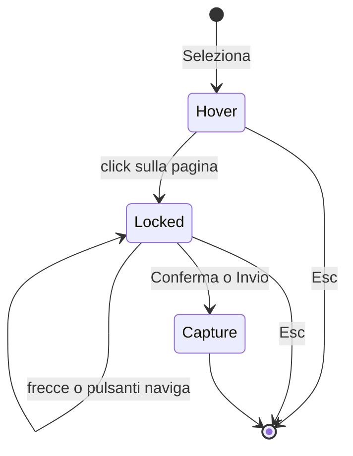

# Ispeziona e salva — blocco e conferma prima della cattura

Data: 2026-09-07  
Stato: approvato in brainstorming

## Problema

Il click sulla pagina conferma subito lo snapshot e toglie l’overlay. Le frecce ↑/↓ e i pulsanti «naviga» vivono solo in hover: dopo il click non c’è tempo per salire al padre o scendere al figlio. Inoltre il focus resta spesso nel pannello Swiss Knife, quindi le frecce della tastiera spostano i controlli del pannello invece della selezione in pagina.

## Obiettivo

Il click **fissa** l’elemento, non lo cattura. L’utente regola il livello DOM e solo dopo preme Conferma (o Invio). Esc chiude tutta l’ispezione.

## Fuori ambito

- Tab Editor, menu multi-formato, nuovi permessi, `debugger`, html2canvas.
- Cambiare overlay visivo (guide, padding, margin, radius) o la pipeline PNG già isolata.
- Aggiornamento live dopo lo snapshot confermato.

## Flusso

1. **Seleziona** nel pannello → overlay in pagina, etichetta «Clicca una sezione». Hover segue il mouse. I pulsanti naviga dell’hover restano disponibili.
2. **Click** sulla pagina → stato *bloccato*: il mouse non cambia più l’elemento. Overlay e card restano. Nessun PNG, nessuna scheda Info definitiva.
3. **↑/↓** (tastiera, card in pagina, pulsanti nel pannello) → padre / figlio come già definito (`navigateUp` / `navigateDown` + trail).
4. **Conferma** (card o pannello) o **Invio** → nasconde overlay, attende il paint, invia snapshot, cattura PNG isolata, pannello Info.
5. **Esc** o **Annulla** in qualsiasi fase di puntamento (hover o bloccato) → chiude l’ispezione intera. Overlay via, pulsante di nuovo «Seleziona». Nessuna cattura. Uno snapshot precedente resta solo se l’utente non ha avviato una nuova selezione (la nuova selezione continua a svuotare la scheda all’avvio).

## Card in pagina (stato bloccato)

Stesso pop-up dell’hover (non un dialog nel pannello), con `pointer-events` attivi:

- tag e dimensioni; righe testo / sfondo / font restano
- pulsanti ↑ e ↓ + etichetta «naviga»
- pulsante **Conferma**
- al click di lock, il focus va su **Conferma** (o sul gruppo naviga) così ↑/↓/Invio/Esc arrivano al documento della pagina, non alla sidebar

Hover: la card può restare informativa; il pulsante Conferma compare o si abilita solo dopo il lock.

## Pannello Swiss Knife (stato bloccato)

Oltre alla card in pagina, il pannello mostra gli stessi comandi:

- ↑ amplia, ↓ restringe
- **Conferma**
- **Annulla** (già presente) = Esc = chiusura completa

Il pulsante header resta «Clicca una sezione» finché l’ispezione è attiva (hover o bloccato). Non torna a «Seleziona» finché non si conferma o si esce.

I tasti ↑/↓/Invio/Esc nel documento del pannello, mentre l’ispezione è attiva, vanno sempre al picker (port `navigate-up`, `navigate-down`, `confirm`, `cancel`). Esc = chiusura completa.

## Architettura

Nessun nuovo permesso. Si estendono picker, port e pannello.

Nuovo messaggio port, ad esempio `type: 'locked'` (selettore, tag, dimensioni), così il pannello mostra i controlli di conferma senza PNG. `snapshot` parte solo da Conferma/Invio.

`installInspectPicker` distingue:

- `disposed` / `cleaned`: smontaggio
- `locked`: click avvenuto, puntatore ignorato
- `choose()` solo da `confirm` / Invio / pulsante Conferma

Il click pagina in hover chiama `lock()`, non `choose()`.

## Errori e limiti

- Picker assente o port chiuso: messaggio esistente, riprova con Seleziona.
- Iframe cross-origin, overflow hidden, elementi fixed enormi: avviso PNG invariato, solo dopo Conferma.
- Dopo Conferma l’overlay non resta in pagina.
- Cambio scheda o navigazione: invalidazione completa come oggi.

## Test

- Click pagina → nessun `snapshot` / nessuna `captureElementPng`; stato locked.
- Dopo lock, ↑/↓ (comando port e pulsanti card) cambiano l’elemento evidenziato (padre/figlio).
- Conferma o Invio → un solo snapshot e cattura PNG.
- Esc in hover e in locked → overlay via, nessun PNG, pannello «Seleziona».
- I pulsanti pannello ↑ ↓ Conferma inviano gli stessi comandi del port.
- Una nuova Seleziona svuota la scheda precedente e riparte da hover.
