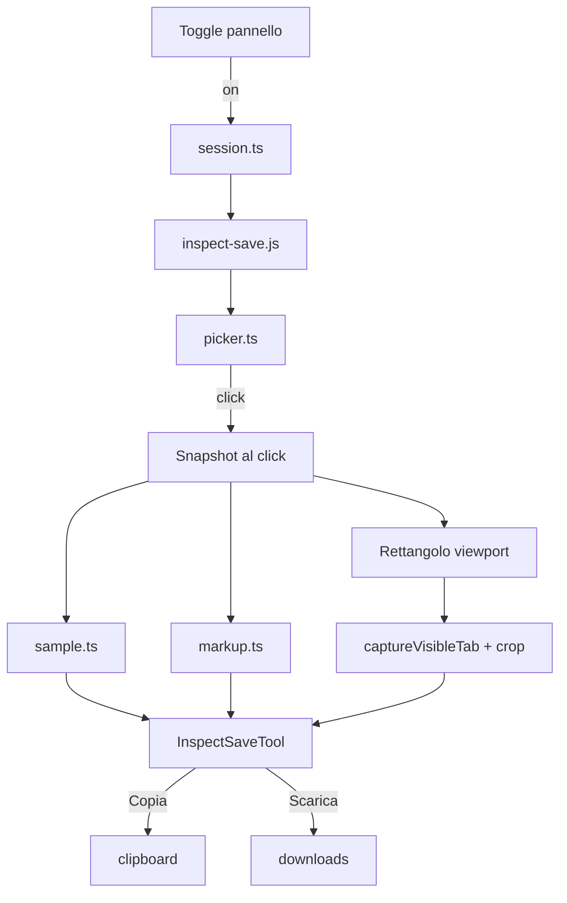

# Ispeziona e salva — design

Data: 2026-09-07  
Stato: approvato in brainstorming e piano di implementazione

## Problema

Serve esplorare visivamente una pagina web e ottenere informazioni sugli elementi senza aprire DevTools. L'utente attiva l'ispezione, passa col mouse sulle sezioni, seleziona un elemento e ottiene una scheda dettagliata con proprietà visive, copia del codice e download PNG.

## Obiettivi (v1)

- Toggle unico nel pannello: spento «Ispeziona e salva», acceso «Clicca una sezione» (track verde).
- Overlay in pagina durante il puntamento: evidenziazione, padding, tooltip essenziale, tastiera ↑/↓/Invio/Esc.
- Click → snapshot (proprietà Info, HTML+CSS del sottoalbero, PNG ritagliato) → overlay rimosso, toggle spento.
- Pannello Inspector con anteprima, Copia codice (snippet HTML+CSS), Scarica (PNG).
- Nessun Editor, nessun nuovo permesso, nessuna persistenza.

## Fuori ambito (v1)

- Tab Editor e modifica live dell'elemento.
- Menu multi-formato Copia/Download (solo HTML+CSS e PNG).
- SVG, PDF, JSON, selettore da solo.
- Shadow root chiusi, interno iframe cross-origin.
- Aggiornamento live dopo lo snapshot.
- Overlay residuo sulla pagina dopo la selezione.

## Catalogo

| Scelta | Valore |
|---|---|
| `id` | `inspect-save` |
| Nome | Ispeziona e salva |
| Icona | `SquareDashedMousePointer` da `lucide-react` |
| Modulo | `src/tools/inspect-save/` |
| Entrypoint | `entrypoints/inspect-save.ts` |
| Permessi | invariati |

## Architettura

## Flusso utente

1. Toggle acceso → iniezione script, overlay attivo, etichetta «Clicca una sezione».
2. Hover → evidenziazione, padding, tooltip (tag, dimensioni, colori, font).
3. ↑/↓ cambiano livello DOM; Invio o click confermano.
4. Click → lettura dati, rimozione overlay, invio snapshot parziale al pannello.
5. Pannello cattura PNG, assembla snapshot, spegne toggle.
6. Esc o toggle spento → annulla puntamento; snapshot precedente resta.
7. Cambio scheda/navigazione → invalidazione completa.

## Pannello

Con snapshot: titolo tag, pill selettore e dimensioni, anteprima PNG espandibile, Copia codice, Scarica, tab Info con sezioni richiudibili (Elemento, Tipografia, Sfondo, Bordo, Spaziatura e dimensioni, Effetti, Layout).

Avviso se PNG ritagliato al viewport. Messaggio export: «Se il file scaricato non è fedele, prova un altro formato» (preparato per v2; v1 ha solo PNG).

## Limiti

- PNG via `captureVisibleTab` + crop: porzione visibile se l'elemento supera il viewport.
- HTML+CSS: sottoalbero sanitizzato, URL immagini originali, CSS curato non dump totale.
- Iframe cross-origin: selezionabile solo l'elemento `<iframe>`.
- Pagine protette: messaggio comune `explainError`.

## Test e verifica

- Funzioni pure: selettore, sample, markup, sanitizzazione.
- Picker: navigazione tastiera, blocco click (jsdom dove possibile).
- Tool: toggle, risposte stantie, invalidazione scheda.
- `pnpm compile`, `pnpm test`, `pnpm build`.
