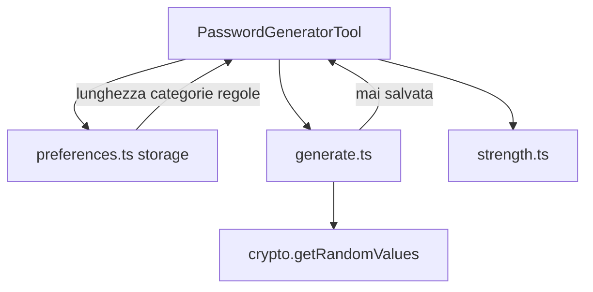

# Generatore password — design

Data: 2026-09-10  
Stato: approvato in brainstorming

## Problema

Swiss Knife ha generatori locali (Lorem Ipsum, hash in Codifica) ma non un modo per creare password sicure nel pannello. Serve uno strumento dedicato, utilizzabile nella sidebar, con controlli chiari e generazione crittograficamente sicura interamente nel browser.

L’immagine di riferimento è solo un esempio visivo: **non va copiata**. Per colori, toggle, densità, raggi e pulsanti vince [design.md](../../../design.md).

## Obiettivi

- Generare password sicure in locale con `crypto.getRandomValues()`, senza modulo bias.
- Controllare lunghezza (4–64), quattro gruppi di caratteri e quattro regole.
- Aggiornare la password **a ogni modifica** dei controlli, incluso lo slider.
- Copiare negli appunti con feedback non invasivo; mostrare/nascondere senza cambiare il valore.
- Indicare la robustezza in modo semplice (Debole / Media / Buona / Robusta).
- Salvare solo le preferenze, mai la password. Nessun invio a server, analytics o log.

## Fuori ambito (v1)

- Passphrase / diceware / parole memorabili.
- Cronologia delle password, anche solo in sessione oltre lo stato React corrente.
- Integrazione con la password prefissata di **Compila form**.
- Dipendenza `crypto-random-string` o altre librerie di generazione.
- Compilazione automatica di campi nella pagina.
- Stima di entropia in bit o meter a quattro barre come nel mockup.

## Approccio

Nuovo strumento di catalogo, non una sezione di Compila form o Codifica.

| Scelta | Valore |
|---|---|
| `id` | `password-generator` |
| Nome | Generatore password |
| Descrizione catalogo | Crea password sicure in pochi secondi. |
| Icona | `KeyRound` da `lucide-react` |
| Modulo | `src/tools/password-generator/` |
| Registro | una sola voce in fondo a `src/tools/registry.ts` |
| Permessi | invariati; nessuno script di pagina |

## Architettura



Unità e dipendenze:

- `generate.ts` — alfabeti, validazione, campionamento uniforme, vincoli, shuffle. Funzioni pure rispetto alla UI; l’unica I/O è `crypto.getRandomValues`.
- `strength.ts` — etichetta qualitativa sulla password **effettiva**, non sulle sole opzioni.
- `preferences.ts` — load/save/normalize delle opzioni. La chiave non contiene mai il valore della password.
- `PasswordGeneratorTool.tsx` — stato, live regen, copia, accessibilità.
- `password-generator.css` — layout compatto sui token di `src/style.css` e `design.md`.

`App.tsx` non riceve rami specifici per questo tool.

## Casualità

Unica sorgente: `crypto.getRandomValues()`. Vietato `Math.random()`.

Per un indice uniforme in `0 .. n-1` (`n >= 1`) usare rejection sampling su un intero a 32 bit:

1. `threshold = floor(2^32 / n) * n`
2. estrarre un `Uint32`
3. se il valore è `>= threshold`, scartare e ripetere
4. restituire `valore % n` (unbiased dopo il rifiuto)

Lo stesso indice si usa per scegliere un carattere da un alfabeto e per Fisher–Yates. Non usare `byte % n` senza rifiuto: introduce modulo bias quando `n` non divide lo spazio del generatore.

## Generazione

### Alfabeti

- numeri: `0123456789`
- minuscole: `abcdefghijklmnopqrstuvwxyz`
- maiuscole: `ABCDEFGHIJKLMNOPQRSTUVWXYZ`
- simboli: `!@#$%^&*()-_=+[]{};:,.<>?`

**Escludi caratteri simili** rimuove da ogni pool attivo: `0`, `O`, `o`, `1`, `l`, `I`, `i`.

I pool vuoti dopo il filtro non contano come categoria attiva ai fini del vincolo “almeno uno per gruppo” (una categoria senza caratteri residui è un errore di regole troppo restrittive).

### Vincoli

Se la configurazione è valida:

1. Costruire il pool combinato dalle categorie attive (dopo il filtro simili).
2. Se **Inizia con una lettera**, il primo carattere è estratto in modo uniforme dal pool lettere (minuscole e/o maiuscole ancora non vuoti).
3. Garantire **almeno un carattere per ogni categoria attiva**, se `length >= numero categorie attive`. Il primo carattere, se già di una categoria, soddisfa quella categoria.
4. Riempire le posizioni restanti dal pool combinato.
5. **Escludi caratteri ripetuti:** ogni carattere al massimo una volta; i già usati escono dal pool. Se a un certo punto il pool è vuoto prima di completare la lunghezza, la config è invalida.
6. Shuffle Fisher–Yates unbiased. Se **Inizia con una lettera**, mescolare solo i caratteri dopo il primo.
7. **Escludi sequenze:** se la stringa contiene una run di 3+ lettere consecutive (case-insensitive) o 3+ cifre consecutive, in avanti o all’indietro (`abc`/`cba`, `123`/`321`), scartare e riprovare. I simboli non partecipano alle sequenze. Tetto **200** tentativi; oltre: errore `Regole troppo restrittive.`

Una sequenza è una tripletta `c0,c1,c2` (scorrendo la password) tale che, dopo aver mappato le lettere su minuscole e considerando solo `[a-z]` o solo `[0-9]` omogenee nella tripletta:

- `code(c1) = code(c0) + 1` e `code(c2) = code(c1) + 1`, oppure
- `code(c1) = code(c0) - 1` e `code(c2) = code(c1) - 1`.

`890` non è una sequenza di tre (9→0 non è consecutivo). `aaa` non è una sequenza (differenza 0); è una ripetizione, penalizzata dalla robustezza se presente.

### Validazione (prima di generare, live)

Messaggi esatti, inline, `role="alert"`:

- Nessuna categoria: `Seleziona almeno un gruppo di caratteri.`
- `length < categorie attive`: `La lunghezza è troppo corta per i gruppi selezionati.`
- Inizia con una lettera e nessuna lettera attiva (o pool lettere vuoto dopo i simili): `Attiva le lettere minuscole o maiuscole.`
- Ripetuti con `length` maggiore del pool unico, pool di una categoria svuotato dai simili, oppure tetto sequenze esaurito: `Regole troppo restrittive.`

Config invalida: campo password vuoto, **Copia** disabilitato, niente etichetta di robustezza presentata come risultato. Tornata valida: nuova password subito.

Range lunghezza: minimo 4, massimo 64. Valori fuori range nel campo numerico si saturano a 4 o 64.

## Robustezza

Valuta la stringa generata, non le sole opzioni.

Punteggio intero:

- `+1` se lunghezza ≥ 8
- `+1` se lunghezza ≥ 12
- `+1` se lunghezza ≥ 16
- `+1` se nella stringa compaiono almeno 3 delle 4 categorie
- `+1` se compaiono tutte e 4
- `−1` (minimo 0) se c’è una sequenza di 3+ come sopra
- `−1` (minimo 0) se un carattere compare più di una volta

Se lunghezza &lt; 8 l’etichetta è sempre **Debole**.

Altrimenti:

- 0–1 → Debole
- 2 → Media
- 3 → Buona
- 4–5 → Robusta

Colori: `--state-danger` / `--state-warning` / `--state-success` (Buona e Robusta sul success, Robusta può usare il testo success più scuro). Indicatore compatto (etichetta + barra corta o badge pill), non quattro barre grandi come nel mockup.

## Preferenze e privacy

Chiave `passwordGeneratorPreferences` in `browser.storage.local`.

```ts
type PasswordGeneratorPreferences = {
  length: number;
  numbers: boolean;
  lowercase: boolean;
  uppercase: boolean;
  symbols: boolean;
  excludeSimilar: boolean;
  excludeSequences: boolean;
  excludeRepeats: boolean;
  startWithLetter: boolean;
};
```

Default:

- `length: 16`
- quattro gruppi: `true`
- `excludeSimilar: true`
- `excludeSequences: true`
- `excludeRepeats: false`
- `startWithLetter: true`

`normalize` ripristina i default per valori assenti, non booleani, o `length` non intero in 4–64. La password **non** è un campo di questo oggetto: se lo storage la contenesse per errore va ignorata.

Persistenza con debounce 300 ms sulle preferenze. La password si aggiorna a ogni `input` dello slider; lo storage no.

La password esiste solo nello stato React. Smontare il tool (uscita dal catalogo, chiusura pannello) la elimina. Non loggare, non includerla nei messaggi di errore, non inviarla.

## Interfaccia

Pannello 360–420px, italiano, tema chiaro, icone Lucide. Riusare gerarchia di **Codifica e converti** (titolo, nota locale, card, azioni pill, errore inline). Slider come in **Colori**.

Toggle: aspetto iOS di `design.md` (track pill, thumb, **sfondo `--state-success` quando attivi**), non indaco del mockup. Dimensioni compatte per la densità della sidebar (track circa 36×22, non 42×26). Implementazione: `input type="checkbox"` nativo con etichetta, non un div cliccabile senza controllo.

Ordine verticale:

1. Titolo **Generatore password** con icona `KeyRound`. Descrizione: **Crea password sicure in pochi secondi.** Riga discreta: `LockKeyhole` + **Elaborazione locale**.
2. Card risultato: label **Password**, lunghezza corrente in `tabular-nums`, campo read-only in `--font-mono` con `overflow-wrap: anywhere`, pulsante mostra/nascondi (`Eye` / `EyeOff`, visibile di default), **Genera** (`RefreshCw`, primario accent) e **Copia** (`Copy`, secondario) affiancati, indicatore robustezza.
3. **Lunghezza password:** `input type="range"` 4–64 e `input type="number"` sincronizzati.
4. **Includi:** quattro toggle (Numeri, Lettere minuscole, Lettere maiuscole, Simboli) con hint `11px` muted dei caratteri (dopo il filtro simili, così l’hint riflette la regola).
5. **Regole:** quattro toggle con descrizione secondaria breve:
   - Escludi caratteri simili — Evita o, O, 0, i, I, l, 1
   - Escludi sequenze — Evita sequenze come 123 o abc
   - Escludi caratteri ripetuti — Ogni carattere al massimo una volta
   - Inizia con una lettera — Il primo carattere non è un numero o un simbolo
6. Nota: **Generazione locale e sicura.** Le password vengono generate nel browser e non vengono salvate né inviate a server esterni.

**Genera** estrae una nuova password con le opzioni correnti (stesso percorso del live). **Copia** scrive il valore **attualmente mostrato** e non rigenera. Feedback: **Copiata** in `role="status"`; se gli appunti falliscono: **Impossibile copiare. Seleziona la password e copiala manualmente.** Mai `alert()`.

Mostra/nascondi cambia solo `type` (`text` / `password`) o un mascheramento equivalente; il valore in stato resta. Copia usa lo stato, quindi funziona anche nascosta.

Alla prima apertura (dopo il load preferenze, o subito con i default se lo storage è vuoto) c’è già una password generata.

## Errori e limiti

- Errori solo inline, vicino a password/azioni.
- Config impossibile: nessuna password parziale presentata come valida.
- Copia disabilitata se non c’è un valore.
- `crypto.getRandomValues` assente (ambiente non browser): messaggio `Generazione non disponibile in questo ambiente.` — nei test jsdom va fornito o mockato in modo uniforme.
- Cambio scheda Chrome: questo tool non legge la pagina, quindi **non** invalida la password visibile (coerente con Codifica).

## Test

Mirati, non copie del markup:

- Rejection sampling: con un `getRandomValues` deterministico che produce valori sopra e sotto la soglia, l’indice non usa il valore scartato; nessun `n % alphabetLength` cieco sulla UI.
- Password di default 16 caratteri con i quattro gruppi: contiene almeno un numero, una minuscola, una maiuscola, un simbolo; inizia con lettera.
- Simili assenti quando la regola è attiva.
- Sequenze `abc`/`cba`/`123`/`321` rifiutate; `890` accettabile rispetto alla regola sequenze.
- Ripetuti: caratteri unici; `length` &gt; pool → errore.
- Zero categorie e length 3 con 4 gruppi: messaggi esatti.
- Inizia con lettera senza lettere: messaggio esatto.
- Robustezza: stringa corta → Debole; 16 caratteri quattro categorie senza sequenze/ripetizioni → Robusta.
- Preferenze: default e normalize; `password` in storage ignorata.
- UI: live regen su toggle e slider; Copia chiama clipboard con il valore corrente e non cambia la password; nascondi non altera il valore; `storage.set` non contiene la password.
- Catalogo in `App.test.tsx`: compare **Generatore password**.
- CSS: raggio card, pill, toggle success, niente palette indaco copiata dal mockup sui track attivi.

Verifiche di consegna: `pnpm compile`, `pnpm test`, `pnpm build`. La Web Crypto e gli appunti nativi si verificano in Chrome se disponibile; i mock non li sostituiscono.

## Documentazione

Aggiornare il README (sezione dello strumento, limiti, generazione locale). `AGENTS.md` invariato: nessun nuovo pattern di iniezione o permesso.
