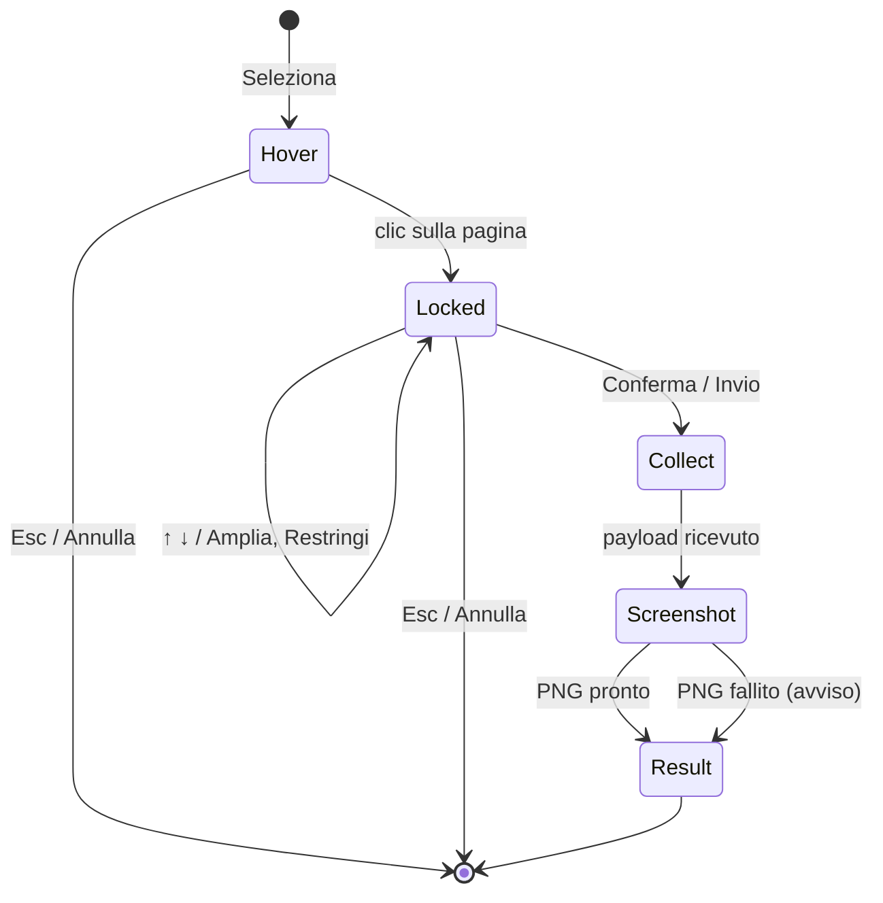

# Browser context — contesto HTML e CSS per agenti AI

Data: 2026-09-16  
Stato: approvato in brainstorming  
Riferimento: [Pinpoint](https://github.com/MarcellM01/Pinpoint) (estensione VS Code, MIT)

## Problema

Un agente AI legge il codice ma non vede l’elemento che l’utente indica nella pagina. Descriverlo a parole («la card sotto il riepilogo meteo») è lento e ambiguo. Pinpoint risolve il problema in VS Code: un clic su un elemento produce un report Markdown con selettore, markup, CSS rilevante e screenshot. Swiss Knife deve offrire la stessa funzione nel browser, senza VS Code.

## Obiettivo

Nuovo strumento **Browser context**: l’utente seleziona un elemento della pagina, conferma, e ottiene un report Markdown in inglese pronto da incollare in qualsiasi agente, copiato negli appunti e scaricabile insieme allo screenshot.

## Fuori ambito

- Selezione multipla o catture in serie; cronologia delle catture; archiviazione persistente di dati della pagina.
- Scrittura in un workspace o integrazione con un agente specifico.
- Serializzazione del contenuto delle shadow root nel markup.
- Screenshot renderizzati dal DOM (modern-screenshot o simili) o nuove dipendenze.
- Nuovi permessi, host o richieste di rete.
- Modifiche al comportamento visibile di Ispeziona e salva.

## Decisioni prese

| Tema | Decisione |
|---|---|
| Consegna | Copia automatica del report negli appunti + download di `.md` e `.png` dal pannello |
| Selezione | Blocca + conferma, identica a Ispeziona e salva (una cattura per sessione) |
| Lingua report | Inglese; interfaccia del pannello in italiano |
| Approccio | Nuovo strumento che riusa il picker di `inspect-save`, reso generico |

## Flusso



1. **Seleziona** nel pannello → iniezione di `browser-context.js`, overlay in pagina. Stato: «Passa col mouse sulle sezioni, clicca per fissare, poi Conferma. ↑ amplia, ↓ restringe, Esc annulla.»
2. **Clic** → elemento fissato; barra di blocco nel pannello con selettore, dimensioni, Amplia, Restringi, Conferma. Tastiera del pannello inoltrata come in Ispeziona e salva.
3. **Conferma** → il picker nasconde l’overlay, attende il paint e chiama `buildContextPayload(element, view)`. Stato «Raccolta del contesto…».
4. Stato «Cattura dell’anteprima…» → isolamento e `captureElementPng` come in Ispeziona e salva. **Un errore di cattura non è fatale**: il risultato arriva senza PNG e il pannello mostra «Anteprima non disponibile: il report non include lo screenshot.»
5. **Risultato** → formattazione del report e tentativo di copia automatica.

## Report

### Struttura

````markdown
# div.card.card--featured

- Page: https://example.com/pricing
- Viewport: 1440 × 900 px, 2x pixel ratio
- Rendered size: 320 × 412 px at (560, 180)
- DOM path: main#app > section.pricing > div.card.card--featured

> 2 stylesheets could not be read (cross-origin): fonts.googleapis.com, cdn.example.net


## Markup

```html
<div class="card card--featured">…</div>
```

## Styles

### Matching rules, as authored
```css
/* assets/app.css */
.card { padding: 24px;
  border-radius: var(--radius-lg); }

/* assets/app.css */
@media (min-width: 768px) { .card--featured { transform: scale(1.04); } }
```

### Other breakpoints (not currently active)
### :hover
### :focus
### :active
### Inherited from ancestors
### ::before
### ::after
### Computed values that differ from the browser default
### CSS variables referenced above
````

Regole di composizione:

- Il titolo è il segmento di selettore dell’elemento: `tag#id`, altrimenti `tag` + fino a 3 classi (escluse `active|hover|focus|selected|open` e le classi dell’overlay), altrimenti `tag:nth-of-type(n)` se ha fratelli dello stesso tag.
- **DOM path**: fino a 8 segmenti uniti da ` > `, fermandosi al primo antenato con id.
- **Rendered size**: `getBoundingClientRect()` arrotondato, coordinate del viewport.
- La nota sui fogli non leggibili compare solo se ce ne sono; elenca gli host unici (massimo 5, poi `and N more`).
- La riga dell’immagine compare **solo nel file scaricato** e solo se il PNG esiste. La versione per gli appunti non la contiene.
- Ogni sottosezione di Styles è un blocco `css` e compare solo se non vuota. Le intestazioni sono esattamente quelle sopra.
- Il report termina con un a capo.

### Raccolta del CSS (`css-rules.ts`)

Scansione di `document.styleSheets` e `document.adoptedStyleSheets` in ordine di documento.

- **Origine**: per ogni regola un commento `/* <percorso> */`. Fogli esterni: pathname dell’URL (host incluso se diverso da quello della pagina). `<style>` inline: `<style> #n` con n = indice 1-based tra i `<style>` del documento. Fogli adottati: `adopted stylesheet #n`.
- **At-rule**: discesa ricorsiva conservando l’involucro nell’output.
  - `@media`: incluso se `matchMedia(mediaText).matches`; altrimenti la regola va in *Other breakpoints* (solo se il selettore corrisponde).
  - `@supports`: incluso se `CSS.supports(conditionText)`.
  - `@layer` (blocco): sempre incluso, con involucro `@layer nome { … }`.
  - `@container`: sempre incluso con involucro e commento `/* container condition not evaluated */`.
  - Altri gruppi con `cssRules`: attraversati senza involucro.
- **Regola corrispondente**: `element.matches(selectorText)`; selettori non validi ignorati.
- **Filtro rumore**: scartata se tutti i segmenti separati da virgola sono `*`, uno pseudo o un tag nudo **e** (i segmenti sono più di 3 **oppure** includono `*`). Un singolo tag (`h1 { … }`) resta.
- **Dichiarazioni**: da `rule.style.cssText`, divise su `;` fuori da virgolette e parentesi (preserva `url(data:…;base64,…)`, `var()` e shorthand come scritti). Formato: `selettore { prima;\n  seconde; }`. Regole senza dichiarazioni scartate.
- **Inline**: `element.style.cssText` non vuoto → regola `element.style` in coda alle corrispondenti.
- **Stati**: rimozione di `:hover`, `:focus`, `:focus-visible`, `:focus-within`, `:active` dal segmento; se il resto corrisponde, la regola va nello stato (focus-visible/within → `:focus`). Rimosse le regole già presenti tra le corrispondenti.
- **Pseudo-elementi**: solo se `getComputedStyle(element, '::before' | '::after').content !== 'none'`; corrispondenza sul segmento privato di `::before`/`::after` (base vuota → `*`).
- **Ereditato**: risalendo gli antenati, le regole corrispondenti ridotte alle sole proprietà ereditabili (elenco di Pinpoint: color, font*, line-height, letter-spacing, text-*, white-space, word-*, visibility, cursor, direction, list-style*, quotes, tab-size, hyphens, overflow-wrap, border-collapse, border-spacing, caption-side, empty-cells).
- **Variabili**: nomi `--x` trovati in `var(--x` nel testo delle regole corrispondenti ed ereditate, valori da `getComputedStyle(element)`; `(unset)` se vuoto.
- **Esclusioni**: fogli e nodi dell’overlay di Swiss Knife (marcati `data-swiss-inspect` o nello shadow host del picker) e la classe `swiss-inspector-outline`.
- **Fogli illeggibili**: accesso a `cssRules` che lancia → host aggiunto a `unreadableSheets`.

Limiti: 40 corrispondenti, 15 altri breakpoint, 12 ereditate, 20 per stato e per pseudo-elemento, 40 variabili.

### Valori calcolati (`resolved.ts`)

- Iframe `about:blank` invisibile (`position:absolute;width:0;height:0;border:0;visibility:hidden`) aggiunto a `documentElement`, elemento vergine dello stesso tag nel suo body, rimosso in `finally`.
- Proprietà tenute: quelle con valore diverso dal riferimento, escluse le vendor (`-…`), alias logici (`block-size`, `inline-size`, `min/max-block/inline-size`, `inset-*`, `margin-block*`, `margin-inline*`, `padding-block*`, `padding-inline*`), `perspective-origin`, `transform-origin`, e i colori che replicano `color` (`caret-color`, `column-rule-color`, `text-decoration-color`, `text-emphasis-color`).
- Ripiegamento: gruppi `margin-*`, `padding-*`, `border-*-radius`, `border-*` (esclusi radius e image) sostituiti dalla shorthand calcolata se non vuota.
- Ordine: shorthand ripiegate, poi proprietà in ordine alfabetico. Massimo 200. In caso di errore: lista vuota.
- La logica di confronto e ripiegamento è una funzione pura su mappe `proprietà → valore`; la lettura DOM è separata.

### Markup (`markup.ts`)

- Sorgente: `element.outerHTML` di un clone da cui sono rimossi attributi `data-swiss-*` e la classe `swiss-inspector-outline` (attributo `class` eliminato se resta vuoto).
- Valori di attributo che iniziano con `data:` e superano 200 caratteri → `data:<mime>;base64,…(N KB)` (o `data:<mime>,…(N KB)`).
- Attributo `d` di `<path>` oltre 200 caratteri → primi 60 caratteri + `…`.
- Oltre 60 000 caratteri → taglio e `\n<!-- truncated: element markup exceeds 60 KB -->`.
- Nessuna rimozione di `script`/`style` interni: il report è testo, non viene mai renderizzato.

## Pannello

- **Catalogo**: `id: 'browser-context'`, nome «Browser context», descrizione «Seleziona un elemento e copia HTML e CSS pronti per un agente AI.», icona Lucide `Crosshair`, in fondo all’array `tools`.
- **Iniziale**: titolo, pulsante **Seleziona**, testo «Seleziona un elemento della pagina per copiarne markup, CSS e anteprima in un formato leggibile da un agente AI.»
- **Selezione**: stato con **Annulla**, barra di blocco come Ispeziona e salva.
- **Risultato**:
  - pillole selettore e dimensioni; anteprima PNG ingrandibile (dialog) se presente;
  - riga «Report: 14 KB · ~3.500 token» (byte UTF-8 del testo per appunti; token = `Math.ceil(caratteri / 4)`, formattazione `it-IT`);
  - azioni: **Copia report** (primaria), **Copia immagine** (disabilitata senza PNG; `ClipboardItem` `image/png`), **Scarica report**;
  - `<details>` chiuso «Anteprima report» con il Markdown per appunti in `<pre>` a sola lettura.
- **Copia automatica**: al risultato, `navigator.clipboard.writeText`. Successo → «Report copiato negli appunti.» Fallimento → «Chrome non ha permesso la copia automatica. Premi Copia report.» (non è un errore). Se fallisce anche **Copia report** → textarea di ripiego «Report da copiare manualmente».
- **Copia immagine** fallita → «Impossibile copiare l’immagine. Usa Scarica report.»
- Feedback e errori vicino alle azioni, con `role="status"` / `role="alert"`.

## Download (`download.ts`)

- Nome base: `reportName(element)` = primo id o classe del segmento del titolo (altrimenti il tag), caratteri non alfanumerici → `-`, minuscolo, max 40 caratteri, fallback `element`; poi `-YYYYMMDD-HHmmss` locale.
- Cartella: `swiss-knife/browser-context/` relativa a Download. `saveAs: false`, `conflictAction: 'uniquify'`.
- Ordine: se c’è il PNG, download del PNG (data URL) → attesa di `downloads.onChanged` fino a `complete` o `interrupted` → nome finale da `downloads.search({ id })` (basename). Poi download del `.md` (Blob URL revocato in `finally`) con il link immagine basato sul nome finale.
- PNG interrotto → `.md` scaricato senza riga immagine e feedback «Screenshot non salvato; report scaricato senza immagine.»
- Successo → «Report salvato in Download/swiss-knife/browser-context.»

## Ciclo di vita e sicurezza

- Stessa gestione di Ispeziona e salva: generazione incrementale, `AbortController`, invalidazione su `tabs.onActivated` (stessa finestra), `onUpdated` con `loading` o `url` sulla scheda target, `onRemoved`; messaggio «Scheda cambiata. Avvia lo strumento per lavorare su questa pagina.» Risultato svuotato.
- Nessuna cattura automatica, nessuna archiviazione, nessuna rete. Permessi esistenti: `activeTab`, `scripting`, `clipboardWrite`, `downloads`.
- Il port è legato al `documentId`; lo script ignora connessioni con `sender.id` diverso dall’estensione; `pagehide` ripulisce.

## Architettura

### Refactoring in `src/tools/inspect-save/`

- `picker.ts`: `installInspectPicker<T>(buildPayload: (element: Element, view: Window) => T, onPick: (payload: T, element: Element) => void, onCancel, onLock)`. `snapshotPayload` esportata come `inspectSnapshotPayload`. Nessun altro cambiamento.
- `picker-host.ts` (nuovo): `runPickerHost<T>({ portPrefix, scopeKey, buildPayload })` con la logica oggi in `entrypoints/inspect-save.ts` (validazione connessione, comandi, `isolate-capture`/`restore-capture`, dispose, `pagehide`, flag di installazione su `scopeKey`).
- `picker-session.ts` (nuovo): `startPickerSession<T extends { rect: InspectRect }>({ tabId, windowId, file, portPrefix, isPayload, screenshot: 'required' | 'optional', toolName, signal, onStatus, onResult, onEnd, onLocked })`. Con `optional`, un errore di cattura chiama `onResult` con `png` assente.
- `session.ts`: `startInspectSession` diventa wrapper con firma invariata (`screenshot: 'required'`).
- `entrypoints/inspect-save.ts`: chiama `runPickerHost` con `swiss-inspect-save` e `inspectSnapshotPayload`.

### Nuovo modulo `src/tools/browser-context/`

| File | Responsabilità |
|---|---|
| `types.ts` | `ContextPayload` (element, path, url, viewport, rect, markup, css, unreadableSheets), `CssContext`, `ContextResult` (+ `png?`) |
| `css-rules.ts` | Scansione fogli, origine, at-rule, filtro rumore, dichiarazioni, stati, pseudo, breakpoint, ereditato, variabili |
| `resolved.ts` | Confronto con riferimento e ripiegamento shorthand |
| `markup.ts` | Pulizia e taglio del markup |
| `collect.ts` | `buildContextPayload(element, view)` eseguito nella pagina |
| `report.ts` | `formatReport(payload, { screenshotFile? })`, `reportName`, `estimateTokens`, `reportSize` |
| `download.ts` | `downloadReport(result, report)` |
| `session.ts` | `startBrowserContextSession` su `startPickerSession` (`optional`) |
| `BrowserContextTool.tsx`, `browser-context.css` | Interfaccia; token di `src/style.css` |

`entrypoints/browser-context.ts`: `runPickerHost({ portPrefix: 'swiss-browser-context', scopeKey: '__swissBrowserContext', buildPayload: buildContextPayload })`.

## Test

- `report.test.ts`: sezioni vuote omesse, riga immagine solo con `screenshotFile`, metadati, nota fogli illeggibili (con troncamento host), `reportName`, stima token.
- `css-rules.test.ts`: filtro rumore, `splitDeclarations` con `url(data:…;base64,…)` e virgolette, origine `<style> #n`, involucro `@media` attivo e regola in *Other breakpoints* (`matchMedia` simulato), `@supports` falso escluso, stati con duplicati rimossi, pseudo-elementi, foglio con `cssRules` che lancia contato, esclusione overlay.
- `resolved.test.ts`: confronto e ripiegamento come funzioni pure, esclusioni.
- `markup.test.ts`: `data:` abbreviati, `d` abbreviato, taglio a 60 KB, rimozione attributi e classe overlay.
- `download.test.ts`: PNG prima del `.md`, link con nome finale rinominato, PNG interrotto, nessun PNG.
- `picker-session.test.ts`: cattura fallita con `optional` → risultato senza PNG; con `required` → `onEnd('error')`.
- `picker-host.test.ts`: payload builder personalizzato, connessioni estranee ignorate, pulizia alla disconnessione.
- `BrowserContextTool.test.tsx`: copia automatica riuscita e fallita, ripiego textarea, invalidazione al cambio scheda, risposte superate ignorate.
- Regressione: test esistenti di `inspect-save` invariati e verdi.

## Verifica

- `pnpm compile`, `pnpm test`, `pnpm build`.
- Prova reale in Chrome su una pagina con media query, `@supports`, variabili, `:hover`, `::before` e un foglio cross-origin: contenuto del report, copia, download con link immagine funzionante.
- Regressione manuale di Ispeziona e salva (selezione, conferma, PNG).
- Aggiornare README (nuovo strumento, limiti: shadow root, iframe e fogli cross-origin, `@container` non valutato) e AGENTS.md (picker condiviso e nuovo modulo).

## Licenza

La logica di raccolta CSS è derivata da Pinpoint (MIT). Aggiungere la voce (copyright © 2026 TinySuite, testo MIT) in `public/THIRD-PARTY-NOTICES.txt`.
